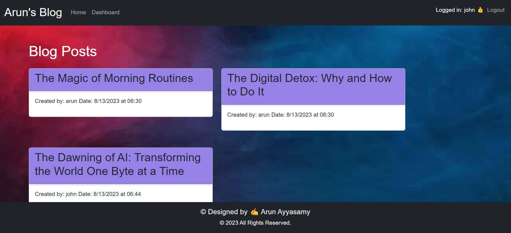
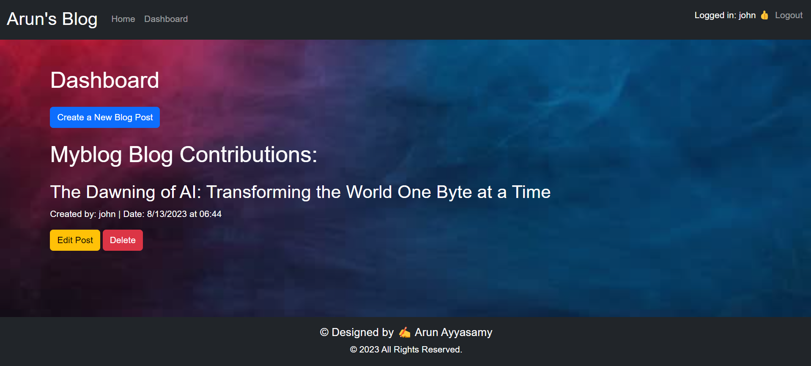

# MyTechBlog1.1

  [](https://opensource.org/licenses/MIT)
 ## Description

In the realm of technology and development, the ability to articulate and share technical knowledge is just as crucial as the skill to create the tech itself. Developers often spend countless hours building applications and rectifying errors in their code. But they also allocate a significant amount of time to learn from articles, tutorials, and think pieces, often written by their peers. Recognizing the vital role that content plays in the developer ecosystem, we introduce **MyTechBlog** - a CMS-style blog platform dedicated to developers.

### **Objective:**

The primary goal of MyTechBlog is to offer developers a space where they can share their experiences, insights, and tutorials, as well as comment on and engage with the content shared by their peers. Drawing inspiration from platforms like WordPress, MyTechBlog aims to simplify the process of publishing tech-focused content while maintaining a sense of community among its users.

### **Features:**

1. **MVC Paradigm**: The application's architecture follows the Model-View-Controller paradigm, ensuring separation of concerns and modular code.
  
2. **Handlebars.js**: Employed as the templating language, Handlebars.js allows for efficient and dynamic content rendering on the platform.
  
3. **Sequelize ORM**: Leveraging Sequelize, the application efficiently handles data modeling, retrieval, and other database operations.
  
4. **express-session**: The application uses the express-session npm package, ensuring user authentication is both secure and effective.
  
5. **User-generated Content**: Users can create, edit, and delete their posts. They can also read, comment on, and engage with posts written by other developers.

6. **Deployment**: The application is deployed on Heroku, making it easily accessible to users worldwide.

### **Why MyTechBlog?**

Just type a technical query on Google, and you're met with thousands of articles, each offering a different perspective or solution. Amidst this ocean of content, **MyTechBlog** strives to provide a platform where genuine, user-generated insights rise to the top, where every developer, irrespective of their skill level, can share and grow.

### **Getting Started:**

To use MyTechBlog, simply register an account, log in, and you're ready to publish your first post or dive into the vast collection of articles and tutorials shared by our community.

---

**Note to Developers:** We appreciate the effort developers put into both building technology and writing about it. MyTechBlog is our tribute to that dedication. Happy coding and happy writing!

  ## Table of Contents
  - [Installation](#installation)
  - [Usage](#usage)
  - [Packages Used](#package-list)
  - [Deployed Link](#deployed-link)
  - [Sample Application](#sample-application)
  - [License](#license)
  - [Questions](#questions)
  ## Installation <a name="installation"></a>
---
### **Prerequisites:**

Before you begin, ensure you have the following installed:

- [Node.js](https://nodejs.org/)
- [MySQL](https://www.mysql.com/)
- A code editor, such as [Visual Studio Code](https://code.visualstudio.com/)

### **Steps:**

1. **Clone the Repository**
   
   Start by cloning the MyTechBlog repository to your local machine.
   
   ```bash
   git clone <repository-url>
   ```

2. **Navigate to the Directory**

   Once cloned, navigate into the directory.

   ```bash
   cd MyTechBlog
   ```

3. **Install Dependencies**

   Install all necessary npm packages by running:

   ```bash
   npm install
   ```

4. **Set up Environment Variables**

   - Duplicate the `.env.example` file in the root directory and rename it to `.env`.
   - Update the `.env` file with your database credentials:

     ```env
     DB_NAME='your_database_name'
     DB_USER='your_username'
     DB_PASSWORD='your_password'
     DB_HOST='your_host'
     ```

5. **Database Setup**

   Start MySQL in your terminal and create the database:

   ```sql
   CREATE DATABASE your_database_name;
   ```

6. **Sequelize Models and Database Syncing**

   Using Sequelize, run the following to create the necessary tables:

   ```bash
   npm run seed
   ```

7. **Start the Server**

   Finally, start the application:

   ```bash
   npm start
   ```

8. **Access the Application**

   Navigate to `http://localhost:3000/` on your browser to access MyTechBlog.

That's it! You should now have MyTechBlog running locally on your machine. Remember, when deploying to a platform like Heroku, you may need additional setup, such as provision add-ons like JawsDB for MySQL database support.
 
## Usage <a name="usage"></a>
 ---
### **Navigating the Site:**

1. **Homepage**

    - Upon accessing `MyTechBlog`, you'll be greeted with a list of the most recent blog posts.
    - Each post displays the title, author's username, and the date it was created.
    - Click on the post title to view the full post and any associated comments.

2. **Login/Register**

    - If you're a new user, click on the `Sign Up` button to create a new account.
    - If you already have an account, click on the `Login` button and provide your credentials.

3. **Creating a New Post**

    - Once logged in, click on the `New Blog Post` button
    - Provide a title and the content for your blog post, then hit `Create Post`.

4. **Commenting**

    - Navigate to any blog post by clicking its title.
    - Scroll down to find the comments section.
    - Type your comment and click the `Submit`.

5. **Editing and Deleting Posts**

    - Navigate to a post you've created. 
    - You should see `Edit Post` and `Delete` buttons next to your post.
    - Click `Edit Post` to modify the content or title of your post.
    - Click `Delete` to permanently remove your post.

6. **Logging Out**

    - Click the `Logout` button, found at the top right or in a user menu, to log out of your account.
 
## Packages Used <a name="package-list"></a>

### **NPM Packages**

1. **express**
    - Description: Fast, unopinionated, minimalist web framework for Node.js.
    - Usage: Acts as the web server for the application.

2. **sequelize**
    - Description: A promise-based Node.js ORM that supports flexible model definition and diverse SQL dialects.
    - Usage: Used for database interactions and model definitions.

3. **mysql2**
    - Description: A MySQL client for Node.js with a focus on performance.
    - Usage: Allows Sequelize to interact with a MySQL database.

4. **express-handlebars**
    - Description: A view engine that integrates Handlebars.js with Express.
    - Usage: Used to generate HTML templates based on the MVC paradigm.

5. **express-session**
    - Description: A middleware for Express.js to manage user sessions.
    - Usage: Manages user authentication sessions, ensuring that users remain logged in between requests.

6. **bcrypt**
    - Description: A library to help hash passwords.
    - Usage: Used for hashing and comparing user passwords to ensure security.

7. **dotenv**
    - Description: A zero-dependency module that loads environment variables from a `.env` file.
    - Usage: Safely loads and uses sensitive information (like database credentials) without exposing them in the code.

8. **connect-session-sequelize**
    - Description: A SQL session store using Sequelize.js.
    - Usage: Used alongside `express-session` to store session data in the SQL database.

## Deployed Link <a name="deployed-link"></a>
URL to the deployed application in heroku: https://mytechblog11-477ef4d290d5.herokuapp.com/

  ## Sample Application <a name="sample-application"></a>
  
  
  
  

## License <a name="license"></a>
  This project is licensed under the MIT license.
  https://opensource.org/licenses/MIT

  ## Questions <a name="questions"></a>
  If you have any questions, please contact me at arun@arun.com. 
  
  My GitHub profile is [arundvp](https://github.com/arundvp).
